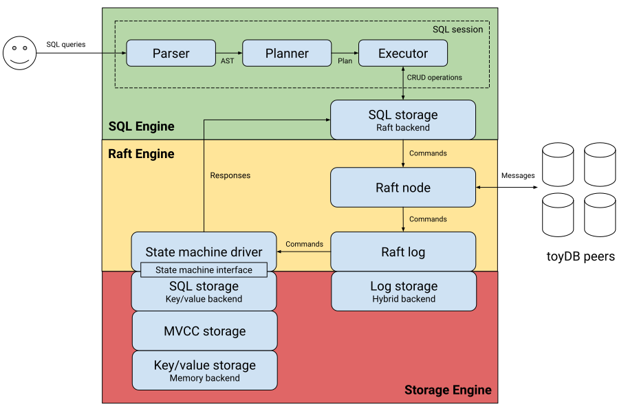

# toyDB

[](https://cloud.drone.io/erikgrinaker/toydb)

Distributed SQL database in Rust, written as a learning project. Most components are built from
scratch, including:

* Raft-based distributed consensus engine for linearizable state machine replication.

* ACID-compliant transaction engine with MVCC-based snapshot isolation.

* Pluggable storage engine with B+tree and log-structured backends.

* Iterator-based query engine with heuristic optimization and time-travel support.

* SQL interface including projections, filters, joins, aggregates, and transactions.

toyDB is not suitable for real-world use, but may be of interest to others learning about
database internals.

## Documentation

* [Architecture guide](docs/architecture.md): a guide to toyDB's architecture and implementation.

* [SQL examples](docs/examples.md): comprehensive examples of toyDB's SQL features.

* [SQL reference](docs/sql.md): detailed reference documentation for toyDB's SQL dialect.

## Usage

With a [Rust compiler](https://www.rust-lang.org/tools/install) installed, a local five-node 
cluster can be started on `localhost` ports `9601` to `9605`:

```
$ (cd clusters/local && ./run.sh)
```

A command-line client can be built and used with the node on `localhost` port `9605`:

```
$ cargo run --release --bin toysql
Connected to toyDB node "toydb-e". Enter !help for instructions.
toydb> CREATE TABLE movies (id INTEGER PRIMARY KEY, title VARCHAR NOT NULL);
toydb> INSERT INTO movies VALUES (1, 'Sicario'), (2, 'Stalker'), (3, 'Her');
toydb> SELECT * FROM movies;
1|Sicario
2|Stalker
3|Her
```

toyDB supports most common SQL features, including joins, aggregates, and ACID transactions.

## Architecture

[](./docs/architecture.md)

toyDB's architecture is fairly typical for distributed SQL databases: a transactional
key/value store managed by a Raft cluster with a SQL query engine on top. See the
[architecture guide](./docs/architecture.md) for more details.

## Tests

toyDB has decent test coverage, with about a thousand tests of core functionality. These consist
of in-code unit-tests for many low-level components, golden master integration tests of the SQL
engine under [`tests/sql`](https://github.com/erikgrinaker/toydb/tree/master/tests/sql), and a
basic set of end-to-end cluster tests under
[`tests/`](https://github.com/erikgrinaker/toydb/tree/master/tests).
[Jepsen tests](https://jepsen.io), or similar system-wide correctness and reliability tests, are 
desirable but not yet implemented.

Execute `cargo test` to run all tests, or check out the latest
[CI run](https://cloud.drone.io/erikgrinaker/toydb).

## Performance

Performance is not a primary goal of toyDB, but it has a bank simulation as a basic gauge of
throughput and correctness. This creates a set of customers and accounts, and spawns several
concurrent workers that make random transfers between them, retrying serialization failures and
verifying invariants:

```sh
$ cargo run --release --bin bank
Created 100 customers (1000 accounts) in 0.123s
Verified that total balance is 100000 with no negative balances

Thread 0 transferred   18 from  92 (0911) to 100 (0994) in 0.007s (1 attempts)
Thread 1 transferred   84 from  61 (0601) to  85 (0843) in 0.007s (1 attempts)
Thread 3 transferred   15 from  40 (0393) to  62 (0614) in 0.007s (1 attempts)
[...]
Thread 6 transferred   48 from  78 (0777) to  52 (0513) in 0.004s (1 attempts)
Thread 3 transferred   57 from  93 (0921) to  19 (0188) in 0.065s (2 attempts)
Thread 4 transferred   70 from  35 (0347) to  49 (0484) in 0.068s (2 attempts)

Ran 1000 transactions in 0.937s (1067.691/s)
Verified that total balance is 100000 with no negative balances
```

The informal target was 100 transactions per second, and these results exceed that by an order
of magnitude. For an unoptimized implementation, this is certainly "good enough". However, this
is with a single node and fsync disabled - the table below shows results for other configurations,
revealing clear potential for improvement:

|             | `sync: false` | `sync: true` |
| ----------- | ------------- | ------------ |
| **1 node**  | 1067 txn/s    | 38 txn/s     |
| **5 nodes** | 417 txn/s     | 19 txn/s     |

Note that each transaction consists of six statements, including joins, not just a single update:

```sql
BEGIN;

-- Find the sender account with the highest balance
SELECT a.id, a.balance
FROM account a JOIN customer c ON a.customer_id = c.id
WHERE c.id = {sender}
ORDER BY a.balance DESC
LIMIT 1;

-- Find the receiver account with the lowest balance
SELECT a.id, a.balance
FROM account a JOIN customer c ON a.customer_id = c.id
WHERE c.id = {receiver}
ORDER BY a.balance ASC
LIMIT 1;

-- Transfer a random amount within the sender's balance to the receiver
UPDATE account SET balance = balance - {amount} WHERE id = {source};
UPDATE account SET balance = balance + {amount} WHERE id = {destination};

COMMIT;
```
